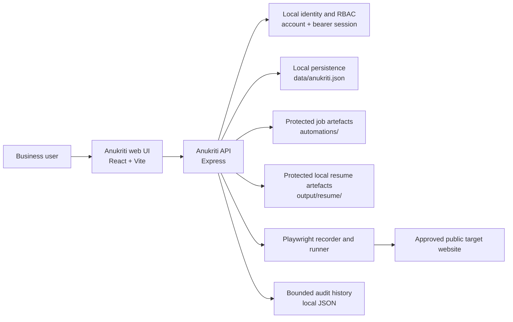
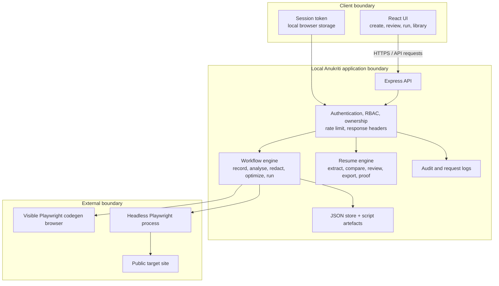
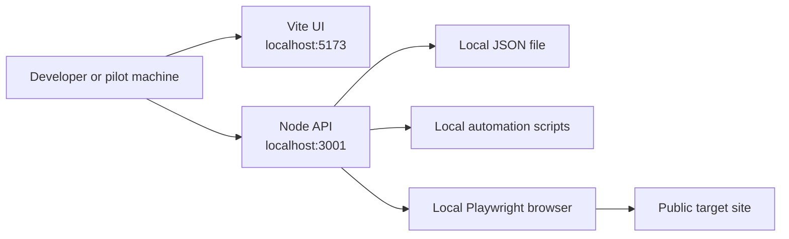
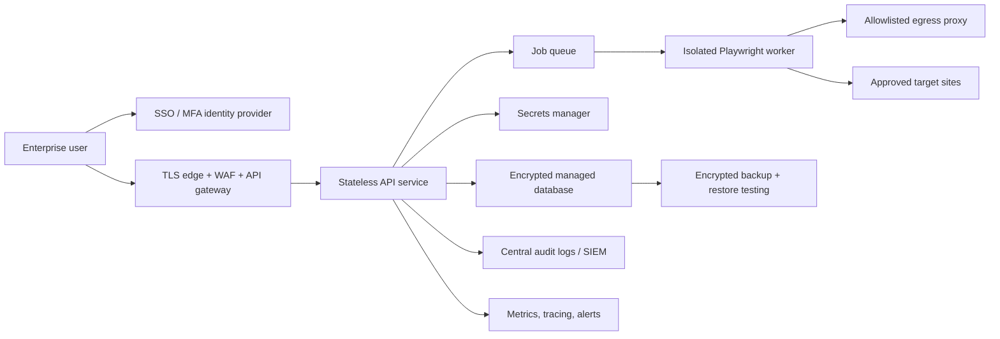

# Anukriti High-Level Design (HLD)

## 1. Purpose and scope

Anukriti turns a repeated browser task or local document-review task into a reusable, reviewable job.

**Primary user outcome:** a user checks the source evidence, reviews a transparent plan, and can safely repeat a local productivity task without repeating the manual work.

**Current scope:** local browser automation with Playwright and local resume-to-job-description comparison with Word-compatible export. Direct macOS app control, scheduling, remote worker execution, live stock data, and enterprise integrations are outside the current MVP scope.

## 2. User journey

1. A user signs in or creates an account.
2. The user creates a browser job and, optionally, a public starting URL.
3. Anukriti opens the Playwright recorder; the user performs the task once.
4. Chayya saves the recording, redacts recognised secret values, automatically creates an owner-protected SOP and Rule Book from the exact captured steps, and shows both.
5. The user reviews a deliberately conservative optimization and saves a runnable job.
6. The user explicitly confirms a rerun; Anukriti runs the reviewed script and records the outcome.

For resume alignment, the user selects an existing local resume and pastes a job description. The local service extracts text, shows evidenced and not-evidenced requirements, asks the user to select review notes, generates a separate `.docx` review copy, and retains proof. The original is never modified.

## 3. System context

## 4. Logical architecture

## 5. Major components

| Component | Responsibility | Data it owns / uses |
| --- | --- | --- |
| React UI | User sign-in, job creation, recording status, step review, confirmation, library, run result | Browser session token; API responses |
| Express API | API contract, validation, authentication, authorization, audit events, error responses | Request/response data; local store |
| Auth module | Password hashing, sign-in, in-memory session lifecycle, role checks | User password hashes/salts; short-lived sessions |
| Workflow engine | Starts codegen, reads recording, redacts sensitive inputs, derives steps, optimizes, runs code | Script files; workflow metadata |
| Resume engine | Extracts local DOCX/text, compares transparent requirements, creates a separate Word review copy and proof | Owner-scoped local resume analysis and export files |
| Security module | Public-target validation and secret-form detection/redaction | URL/code input only |
| Local store | Users, jobs, histories, audit events | `data/anukriti.json` |
| Artefact store | Raw recordings and generated Playwright scripts | `automations/*.spec.js` |
| Playwright | Records a user’s browser actions and replays saved code | Browser session at recording/run time |

## 6. Trust boundaries and data classification

| Boundary / data | Classification | Current treatment |
| --- | --- | --- |
| User password | Sensitive credential | Salted `scrypt` hash in local store; never returned by API |
| Browser session token | Sensitive credential | Expiring bearer token in local browser storage; in-memory API session |
| Recorded browser script | Confidential; may contain business process data | Authorised download only; sensitive recognised fills redacted |
| Target-site credentials | Highly sensitive | User enters them into recorder; recognised secret fields are replaced with runtime placeholders |
| Job metadata and run output | Internal/confidential | Owner/admin API access; bounded local history |
| Audit data | Security/confidential | Local bounded log, admin API access |

## 7. Security controls in the current design

- Account authentication and expiring sessions.
- API-side roles and job ownership checks.
- Protected script download endpoint.
- Input body-size limit, rate limit, and defensive response headers.
- URL checks block non-web, local, private-network, and credentialed starting targets.
- Recorded `goto` targets are checked again at generate and run time.
- Recognised password/token/secret/card fields are redacted before recording persistence.
- Risky action wording is visibly flagged and every run requires explicit confirmation.
- A run is stopped after two minutes; output and audit history are bounded.
- Resume input is limited to 2 MB, stored only locally for the owner’s review/export, and can be explicitly deleted with generated copies.

Read [the threat model](THREAT_MODEL.md) for limitations and required production controls.

## 8. Current deployment topology

This topology is suitable only for a controlled local demo or pilot. It is not a public multi-tenant production architecture.

## 9. Target production topology (not implemented)

For a free local approximation of this topology, see [the hackathon deployment profile](FREE_HACKATHON_DEPLOYMENT.md). It provisions Keycloak, PostgreSQL, Prometheus, Grafana, and Anukriti through Docker Compose, while clearly retaining the app’s current local identity/storage limitations.

## 10. Architecture decisions

| Decision | Rationale | Trade-off |
| --- | --- | --- |
| Use Playwright codegen | Produces real editable browser code from actual actions | Target sites may change and break selectors |
| Preserve raw recording | Enables review, traceability, and correction | Retained artefacts need strong access control |
| Conservative optimization only | Avoids silently changing business process behaviour | Fewer opportunities for automation optimization |
| Explicit confirmation before run | Reduces risk of accidental consequential actions | Adds one user interaction per run |
| Local JSON storage for MVP | Fastest hackathon/pilot implementation | Not safe or durable enough for enterprise production |

## 11. Known limitations

- No hosted identity, MFA, SSO, secure cookies, or session persistence after API restart.
- No tenant/workspace model; ownership is local-account based.
- No managed encryption at rest, database migrations, or backup/restore automation.
- No isolated job workers or DNS-aware egress enforcement.
- Redaction is pattern-based and should be replaced by a secrets-vault workflow for production.
- No scheduling, notifications, external integrations, or production observability platform.
- No direct macOS Word/Pages automation or screen-click recorder. The current safe boundary is a separately generated `.docx` review copy.
- No live stock-data adapter. A future dashboard needs a vetted price provider, provenance/freshness labels, and investment-risk controls.
