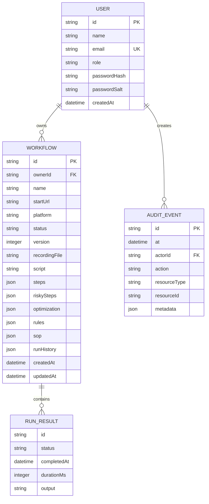

# Anukriti Low-Level Design (LLD)

## 1. Source map

| File | Responsibility |
| --- | --- |
| `src/main.jsx` | Browser UI, sign-in, job creation, review, library, protected download, run polling |
| `server/index.js` | HTTP routes, middleware, authorization, workflow lifecycle orchestration, audit events |
| `server/auth.js` | Account validation, `scrypt` password hashing, in-memory bearer sessions, role checks |
| `server/security.js` | Target URL validation, recorded target checks, recognised-secret redaction |
| `server/workflows.js` | Playwright codegen/runner process control, step analysis, automatic SOP/Rule Book generation, safe optimization |
| `server/store.js` | Local JSON read/write and bounded audit storage |

## 2. Core data model



The physical local store is `data/anukriti.json`. `runHistory` is embedded in each workflow and is capped at 20 entries; audit entries are capped at 500.

## 3. Workflow state model

```mermaid
stateDiagram-v2
  [*] --> Draft
  Draft --> Recording: start recording
  Recording --> Finalizing: recorder process closes
  Finalizing --> Recorded: complete codegen file is promoted atomically
  Finalizing --> Draft: no complete capture; keep previous completed version
  Recording --> Draft: recorder closes without valid steps
  Recorded --> Ready_to_run: generate reviewed job
  Ready_to_run --> Recording: record updated process
  Ready_to_run --> Ready_to_run: confirmed run completes
  Draft --> Optimized: user saves review note
  Optimized --> Recording: record process
```



`Ready to run` is stored as a display string in the current implementation. A run uses a temporary `Running` value inside `lastRun`, then becomes `Passed` or `Failed`.

## 4. Record → review → run sequence

```mermaid
sequenceDiagram
  actor User
  participant UI as React UI
  participant API as Express API
  participant Store as JSON store
  participant PW as Playwright

  User->>UI: Create job
  UI->>API: POST /api/workflows
  API->>API: Validate role, ownership, public URL
  API->>Store: Save Draft workflow + audit event

  User->>UI: Record this job
  UI->>API: POST /api/workflows/{id}/record
  API->>Store: Mark Recording + audit event
  API->>PW: Start codegen with optional start URL
  User->>PW: Perform target-site task; close recorder
  UI->>API: GET /api/workflows/{id}/recording (poll)
  API-->>UI: Non-final preview only; workflow remains Recording
  PW-->>API: Recorder process closes
  API->>API: Redact, syntax-check, analyse and atomically promote complete capture
  API->>API: Generate owner-protected SOP/Rule Book from the exact redacted steps
  API->>Store: Save Recorded state + immutable raw steps + SOP revision + audit event
  API-->>UI: Complete captured steps, SOP/Rule Book, and code

  User->>UI: Review & optimize
  UI->>API: POST /api/workflows/{id}/generate
  API->>API: Recheck recorded targets; remove only adjacent duplicate goto/fill
  API->>Store: Save generated script plus separate immutable raw steps and optimized steps
  API-->>UI: Raw capture, runnable code, and optimization notes

  User->>UI: Confirm and run
  UI->>API: POST /api/workflows/{id}/run {confirmed:true}
  API->>Store: Mark run Running + audit event
  API->>PW: npx playwright test
  PW-->>API: Exit code and bounded output
  API->>Store: Save Passed/Failed run and audit event
  UI->>API: GET /api/workflows/{id}/run (poll)
  API-->>UI: Run result/history
```

## 5. API contract summary

All `/api` routes except `/api/health`, `/api/auth/register`, and `/api/auth/login` require `Authorization: Bearer <token>`.

| Method and path | Roles | Behaviour |
| --- | --- | --- |
| `GET /api/health` | Public | Liveness response |
| `POST /api/auth/register` | Public | Creates account; first account is admin |
| `POST /api/auth/login` | Public | Returns bearer token and user profile |
| `POST /api/auth/logout` | Signed-in | Revokes current session |
| `GET /api/auth/me` | Signed-in | Returns current user profile |
| `GET /api/workflows` | Signed-in | Lists owner jobs; admin can see all local jobs |
| `POST /api/workflows` | Admin, creator | Creates owner-scoped browser job |
| `POST /api/workflows/{id}/record` | Admin, creator, owner/admin access | Starts recorder |
| `GET /api/workflows/{id}/recording` | Owner/admin access | Polls/readies recording |
| `GET /api/workflows/{id}/sop` | Owner/admin access | Downloads the current redacted SOP and Rule Book in Markdown |
| `POST /api/workflows/{id}/recording/waits` | Admin, creator, owner/admin access | Queues a reviewed wait after the latest observed non-final recorder action; it is promoted only when the recorder closes |
| `POST /api/workflows/{id}/feedback` | Admin, creator, owner/admin access | Adds review rule/note |
| `POST /api/workflows/{id}/waits` | Admin, creator, owner/admin access | Adds/replaces/removes a 0.5–10-second reviewed wait after a captured action and requires runnable code to be regenerated |
| `POST /api/workflows/{id}/generate` | Admin, creator, owner/admin access | Generates safe reviewed script |
| `POST /api/workflows/{id}/run` | Admin, creator, runner, owner/admin access | Requires `{ "confirmed": true }` |
| `GET /api/workflows/{id}/run` | Owner/admin access | Gets current run state |
| `POST /api/workflows/{id}/duplicate` | Admin, creator, owner/admin access | Creates a new Draft copy |
| `DELETE /api/workflows/{id}` | Admin, creator, owner/admin access | Deletes workflow metadata |
| `GET /automations/{filename}` | Owner/admin access | Downloads a recording/generated script |
| `GET /api/audit` | Admin | Reads bounded audit log |
| `GET /api/users` | Admin | Lists local user profiles |
| `PATCH /api/users/{id}/role` | Admin | Changes a role with self-demotion guard |

## 6. RBAC matrix

| Capability | Admin | Creator | Runner | Viewer |
| --- | ---:| ---:| ---:| ---:|
| View own job | Yes | Yes | Yes | Yes |
| View another user’s job | Yes | No | No | No |
| Create, record, edit, generate own job | Yes | Yes | No | No |
| Run own job | Yes | Yes | Yes | No |
| Download own job artefact | Yes | Yes | Yes | Yes |
| Duplicate/delete own job | Yes | Yes | No | No |
| Manage users and roles | Yes | No | No | No |
| View audit log | Yes | No | No | No |

In all non-admin cases, the workflow owner check is enforced server-side.

## 7. Error and recovery handling

| Situation | API/UI behaviour | User recovery |
| --- | --- | --- |
| Missing/invalid sign-in | `401` | Sign in again |
| Insufficient role or ownership | `403` | Ask owner/admin for access |
| Invalid/unsafe target | `400` | Use an approved public HTTP(S) target |
| No recording available | `409` during generation | Record and close the browser first |
| Recording closes without steps | Job returns to Draft with message | Record again |
| Another run in progress | `409` | Wait for the current run result |
| Playwright fails or times out | Run saved as Failed with output | Inspect output and record/update job |
| Target site changed | Script fails by selector/navigation | Re-record and review a new version |

## 8. Security processing detail

1. The API validates the starting URL at job creation.
2. Before code generation and execution, every literal `page.goto()` target is validated again.
3. When a recording is read, recognised sensitive field names are converted to `ANUKRITI_SECRET_n` placeholders before the recording is persisted for later use.
4. Generated and raw scripts are available only through an authenticated owner/admin download route.
5. Any browser job run requires explicit confirmation, even if no risk keyword was detected.

## 9. Non-functional controls and limits

| Area | Current limit/control | Production direction |
| --- | --- | --- |
| API body | 64 KB | Gateway/request schema limits |
| API rate | 120 requests/IP/minute in memory | Distributed rate limiter/WAF |
| Session | 8-hour in-memory bearer session | IdP + secure HttpOnly session/token rotation |
| Run duration | 2 minutes | Queue/worker resource quotas and retries |
| Output | Last 6,000 characters | Central secure log retention |
| Run history | 20 per job | Database retention policy |
| Audit log | 500 entries | Immutable central audit/SIEM retention |

## 10. Test traceability

| Design area | Automated verification |
| --- | --- |
| Workflow defaults, step analysis, safe optimization | `server/workflows.test.js` |
| URL blocks and redaction | `server/security.test.js` |
| Authentication, ownership, recorder-to-run API journey | `server/recording.integration.test.js` |
| User-visible sign-up, record, review, optimize, confirmation, run | `server/browser.e2e.test.js` |

Run all checks with `npm run check`.

## 11. Free hackathon deployment

The repository includes a local Docker Compose profile with Keycloak, PostgreSQL, Prometheus, Grafana, and the Anukriti Playwright application container. The application exposes liveness, readiness, and Prometheus metrics endpoints for that stack. See [the free hackathon deployment profile](FREE_HACKATHON_DEPLOYMENT.md) for setup and its explicit non-production limitations.
