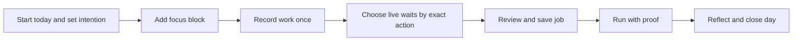

# Daily productivity loop

## Purpose

Chayya helps a person retain the value of work they complete once. The **Today** workspace provides a deliberate morning-to-EOD record of focus and reusable-job progress; it is not covert time tracking.

## User journey

1. The user opens **Today**, writes an optional intention, and selects **Start today**.
2. They add explicit focus blocks for meaningful work.
3. While a browser job is recording, the user may choose any observed click, selection, navigation, or keyboard action in the live rail and attach a 0.5, 1, 2, or 3-second wait. This is persisted immediately and becomes a recorded timeout after that exact action when recording stops.
4. Creating, preparing, and replaying a job adds a meaningful activity to the active workday. Metrics count unique jobs/routes rather than duplicate preparation clicks.
5. At EOD, the user adds an optional reflection and closes the workday.

## Privacy and trust boundary

- No workday exists until the account owner explicitly starts it.
- The API only returns the authenticated owner's workday. It carries `Cache-Control: no-store`.
- The assistant is deterministic, local, and guidance-only. It neither calls an AI model nor operates a browser or shares user data.
- Captured browser steps remain reviewable. A pause is an explicit user choice, never an inferred delay.
- The current JSON store is local but not encrypted at rest; this is a known production gap.

## Acceptance evidence

| Journey | Expected result | Automated evidence |
| --- | --- | --- |
| Start, focus, close a day | Owner sees an intentional daily timeline and EOD summary | `server/workday.test.js` |
| Workday API boundaries | Invalid input and activity before Start today are rejected | `server/workday.test.js` |
| Add a live pause | A pause can be attached during capture and persists to the reviewed job | `server/browser.e2e.test.js`, `server/recording.integration.test.js` |
| Job work enriches Today | Create/prepare/replay events update unique-route metrics | `server/browser.e2e.test.js`, `server/recording.integration.test.js` |
| Stable demo execution | All five controlled local demo jobs pass real Playwright replay | `server/controlled-demo.e2e.test.js` |
| Release regression | API, browser, desktop, and frontend build complete | `npm run check` — 37 app tests, 1 desktop security test, and production build passed |

## Demo-safe scope

The five controlled demos are the reliable end-to-end demo surface. Public third-party sites such as Bing can change structure, rate limit, or challenge automation, so they are not presented as a guaranteed production workflow. The application blocks CAPTCHA/bot-verification bypasses rather than attempting to evade them.
