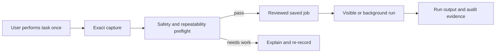

# Productivity iteration release

## Product goal

Chayya lets a person teach a recurring task once, inspect the exact captured steps, save a safer reusable job, and run it again with visible proof. The purpose is to remove repeated manual effort without hiding what will happen.

## Design decisions

- Browser capture is Playwright codegen. Raw capture remains visible and is never silently rewritten.
- Optimization removes only identical consecutive navigation or form-entry actions.
- The repeatability preflight blocks generic positional selectors such as `div … nth(3)` and embedded-frame body clicks. These were the cause of prior Bing/FIFA-style timeouts.
- CAPTCHA and bot-verification steps are rejected. Chayya does not bypass Cloudflare, Turnstile, reCAPTCHA, or hCaptcha.
- Visible execution is the default after a failed run; background execution is available only after review, fresh confirmation, and a successful visible rehearsal of the exact saved script version.

## Five demo jobs

The app now adds five first-party controlled demo jobs. They do not use live websites, advertisements, purchases, authentication, or CAPTCHAs.

| Job | Demonstrates | Expected result |
| --- | --- | --- |
| Demo: FIFA World Cup briefing | Fill a topic, build a research brief | `FIFA World Cup briefing ready` |
| Demo: Stock technical snapshot | Enter a stock symbol, produce a fixed demo snapshot | `AAPL technical snapshot` |
| Demo: Best-deals comparison | Enter an item and budget, compare fixed demo options | `Comparison ready` |
| Demo: Daily stand-up digest | Choose a workstream, create a concise local digest | `Daily stand-up digest ready` |
| Demo: Invoice exception check | Enter an invoice ID and review amount band | `Invoice check ready` |

Each is an already-saved job. It can be run immediately, or re-recorded on the controlled page to demonstrate the complete capture → review → optimize → visible-run loop.

## Demo runbook

1. Start Chayya and sign in as an admin or creator.
2. Select **New browser job** → **Add five stable demo jobs (recommended)**.
3. Open a job. To show execution, select **Visible browser**, check the review confirmation, and choose **Open visible browser**.
4. To show teaching once, choose **Record this job**. Complete the small task on the controlled page, close the recorder browser, check the saved steps, then choose **Review & optimize job** and run it visibly.
5. Repeat for the remaining four jobs. Each run has its own timestamp, output, and history entry.

The full local Playwright test runs all five jobs against the app's own pages and verifies one passing test per job.

## Daily productivity loop

1. Open **Today** at the start of the day, set a short intention, and select **Start today**. Nothing is tracked before this explicit action.
2. Add meaningful focus blocks. Job milestones are added automatically only while the workday is active: recording started, job created/prepared, and replay result.
3. When recording, use the live action rail to select an observed click or keyboard action and add a 0.5, 1, 2, or 3-second pause before continuing. The choice is saved immediately and inserted after that exact action when the capture closes.
4. At EOD, add a reflection and choose **Close today**. The timeline and summary preserve the proof of deliberate work and reusable output.

The Odyssey Assistant is available from sign-in through sign-out. It gives deterministic local guidance and navigation help; it does not send a prompt, call a model, operate a browser, or share user data.

## Feasibility boundaries

| Request | Status | Reason |
| --- | --- | --- |
| Record and replay stable browser work | Available | Exact Playwright capture, preflight, confirmation, and run history. |
| Run in a visible browser | Available | User can see the replay and intervene. |
| Run known public sites indefinitely | Not guaranteed | Page structure, logins, rate limits, and bot checks are external changes. |
| Bypass CAPTCHA or bot verification | Not supported | Unsafe and outside the product boundary. |
| Replay arbitrary Mac desktop clicks | Not planned for this demo | Fragile and unsafe without app-specific accessibility contracts. |

## Verification evidence

- Unit/API/browser checks cover security, workflow capture, wait insertion, business process routing, and RBAC.
- The controlled demo integration test creates all five jobs, starts the local app server, and runs each job with real Playwright. All five pass.
- `npm test` is deliberately serial: API/browser tests bind their own temporary localhost server and must not compete for ports.

## Experience enhancement: mission progress

Browser jobs now use an evidence-based progress rail: **Define → Capture → Safety check → Visible rehearsal → Run & proof**. It is intentionally gamified through earned checkpoints rather than points, streaks, or unsupported time-saving claims. A background run remains locked until the same saved script fingerprint has passed visibly. Each run now produces an Execution proof card with mode, duration, version, step count, check result, recovery guidance when needed, and collapsed sanitized technical details.

During live capture, previews now redact sensitive values in memory only. The recorder's temporary codegen file is never rewritten while Playwright is still writing it.

## Remaining production polish

1. Package the Electron shell with signing/notarization.
2. Add per-job selector health checks on each run and a repair suggestion flow for normal public-site changes.
3. Add signed application updates, encrypted local secrets, and automated backup/restore before a real production launch.
4. Add accessibility checks, screenshots/traces on failure, and CI execution on a clean macOS runner.
